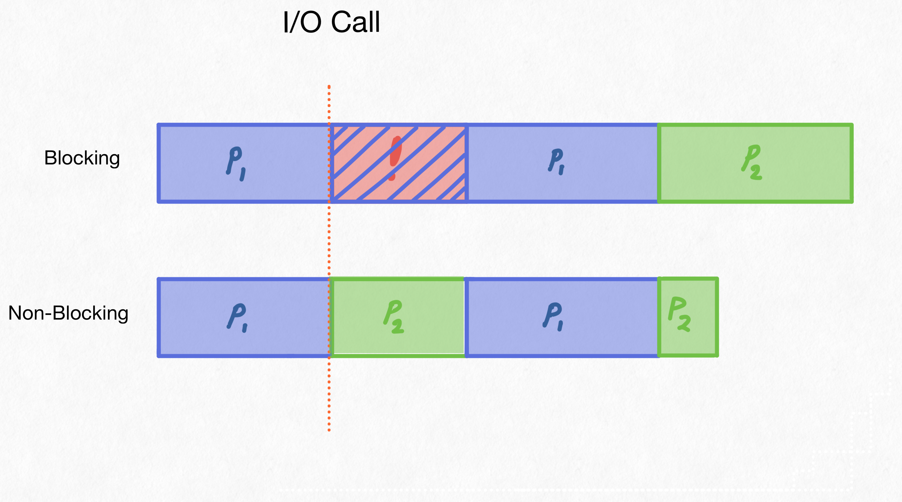
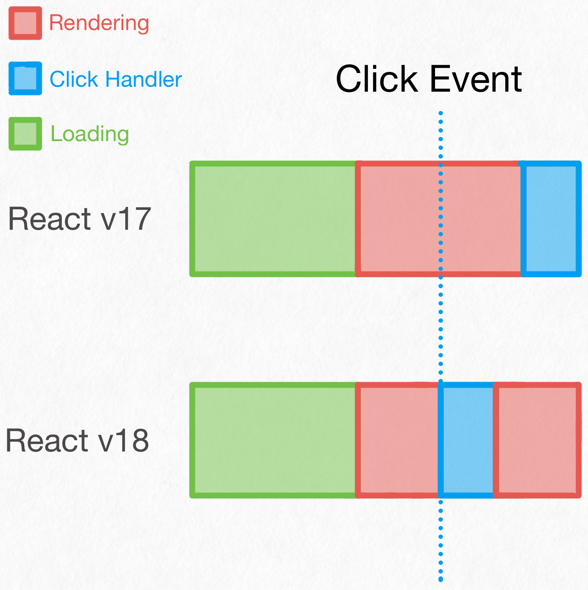

The React team has implemented concurrency, on a single threaded V8 execution context. How does increased concurrency help when you only have one thread? This problem has been solved already, thankfully. Let's take a look at how Operating Systems developers were able to increase the performance of their hardware through the CPU scheduler.

First, if you haven't read the [React team's writeup on their concurrency feature](https://17.Reactjs.org/docs/concurrent-mode-intro.html), or [their more recent React v18 updates](https://reactjs.org/blog/2022/03/29/react-v18.html#what-is-concurrent-react) you should. They explain how they implemented it and how to use it.

## How does multithreading increase performance on a single-core CPU?

Operating systems have long used schedulers to more fairly allocate resources to the processes running within them. In a computer with one processor and execution context, multi-threading can be used to reduce blocking calls. For example, if we have a few threads running at once, and one makes an I/O call:

In our first example, P1 holds onto the CPU while the disk is fetching the data it needs. The computer is locked up, nothing else can happen. If the user clicks, nothing. This is the fundamental problem with blocking calls, nothing is happening and our CPU sits idle.

This was fixed with scheduling. When a process made a request for I/O, it would be kicked off the CPU and placed in a waiting queue. This would allow the CPU to process some more data, refresh the user interface, or whatever it had ready to be run. Eventually, the I/O request returns, P1 is scheduled again and continues its execution.

The fundamental difference here is we are increasing the CPU's usage over time, commonly referred to as utilization. Higher utilization of the CPU means the user is getting all the performance they paid for.

## React's Blocking Calls

In React v17 and before, rendering calls were *blocking*, just like our I/O calls above. While React was rendering your component it could do nothing else. Again, just like I/O calls, a click or other activities were held up by the render. 

Let's first look at how removing the blocking call can increase performance. We'll focus on responsiveness later. Using an API call as an example, we'll show how pre-rendering a bit of the page can reduce overall wait times for your user.

Here we have our 3 tasks.
1. Load the page and fire off the API call
2. Render a skeleton of the page
3. Render the data of the page

React 18 limits its idle time by rendering a skeleton into memory while waiting for the blocking API call. React 17 has to wait until the API call is over to begin rendering the skeleton. This leads to a faster load time after the data has returned which in turn means your page will load faster overall. All on one thread!

{}
React v18 can also keep displaying a loading screen longer while rendering as well as it renders your new page in memory. 
It will also interrupt currently rendering versions of your page if new data comes in. Before, React would render your stale components, see the new data, then re-render your components.
{}

## Increasing Responsiveness

Operating Systems and React face incredibly similar problems here. They both have a set of tasks with different estimated runtimes, priorities, and I/O usage. A worst-case scenario is your CPU kicking off a blocking I/O call right as you click on a button. Your button press seems to take ages while spinning rust finds the exact bit you requested. With interruption, the CPU can stop executing whatever it's doing to process the button animation and your click. The difference can be massive to a user's perception of responsiveness.

In React terms, this could be buffering rerenders on an input field change, or the button click of a search bar responding while the results populate on screen. These rendering changes won't block each other and will render in order of priority, giving the user a better experience.

## In Conclusion

Similar to how Operating Systems used multithreading on single processor systems to remove the effects of blocking I/O calls, the React team has used increased concurrency to reduce the effect of blocking rendering calls, resulting in faster execution and a better user experience. There's only one downside, added code complexity! Hopefully for most of us, this can be abstracted away into routers and component libraries.

Thanks for reading, and if you liked this post, you might want to read my... oh this is my first blog post. Well, come back soon I guess!